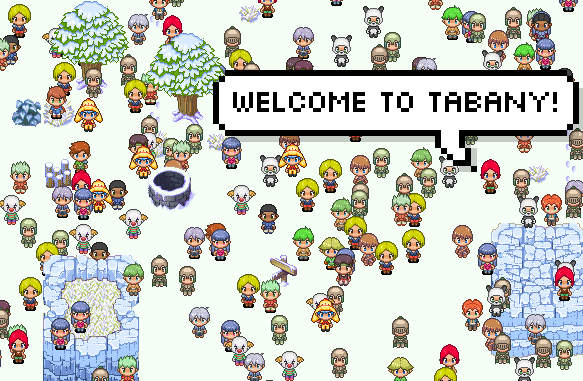

Tabany
======



Tabany is a free and open-source browser-based MMORPG, written in JavaScript and for Node.js.

Try out a live demo at [tabany.nodejitsu.com](http://tabany.nodejitsu.com/).


Backstory
---------

"Tabany" is the informal name of the planet T.A.B.A.N.Y. (The Artificial Biological Anomaly Near You), which is the setting for the game. Geographically- and atmospherically-speaking, Tabany is Earth-like, and is inhabited by the descendants of a stranded band of intergalactic settlers. The planet was specially-engineered to preserve life indefinitely among its inhabitants.

However, due to an error in the planet's design, its age regresses at a rate faster than it progresses. The consequence of this is that all life on Tabany is completely destroyed after a period of seven days. But Tabany also has a fail-safe feature which will revitalize its inhabitants to their original state if a mass extinction ever occurs. So, every seven days, the planet is reborn.


Gameplay
--------

Players are dropped into a world in which they can interact with other players (in real-time) on an endless, seamless landscape. 

There are various Objectives which players can pursue over the course of the Tabanese Week. They can opt to band together in "clans" (of two to sixteen players) to better their chances of survival and success. Those who complete the Objectives are hailed as "W.I.N.N.E.R.S." at Week's End. After the Week comes to a close, the planet is reset, and all players are on equal-footing once again. In this way the gameplay could be considered "session-based," albeit the sessions are rather long-lived.

The world is "partially-modifiable." Some areas are customizable for strategic or aesthetic purposes, and others are not at all (for the sake of mobility). Think "secret bases" from Pokémon Diamond and Pearl, but on a grander scale.

Players view themselves from a top-down perspective in the classic Final Fantasy / Zelda fashion. Exploration and environment will also feel similar to that of tilemap-based games, however players will be able to move pixel-by-pixel (breaking the bounds of tiles) and (in some cases) on multiple dimensions.


Status
------

Tabany is currently being actively developed. It has just reached the "Alpha" stage on its release schedule. (See docs/design_document.md.)

Respectable portions of both the client and server-side components of the game engine have written. It is currently possible for multiple players to move around and chat with each other on the same map in real-time. Drawing, collision detection, rudimentary entity interpolation, JSON and image data pipelining and basic player identification/authentication have been implemented. There is also a pretty solid RequireJS program structure to keep everything organized, and all code is commented.

The game engine will can not be officially deemed "stable" until it has been throughly tested; the "Epsilon" release is guaranteed to be stable, but some earlier releases may be fortunate enough to also bear that title. However, each release should run smoothly for the most part. Nightly pushes should *at least* not crash after 3 seconds.

One of the ultimate goals of the project is that anyone will be able to `git clone` and run his own slice of Tabany on his own webserver... and maybe even connect his server to a web of other Tabanies, which altogether form one gigantic, majestic GPL-licensed MMORPG universe. *Ah!*

Performance will be heavily-scrutinized once all essential features of the engine are implemented, and in the meantime stupid algorithms will be avoided, or at least quickly-replaced.

Graphics are on the horizon; until then, the game will utilize RPG Maker assets (available under separate terms than that of Tabany's code).

For more info on project goals see docs/design_document.md.


Usage
-----

To install:

```bash
$ git clone https://github.com/jacksonrayhamilton/tabany.git
$ cd tabany
$ npm install
```

After installing, to run the server (assuming the current directory is `tabany`):

```bash
$ node app
```

Enjoy.


Contact
-------

Send an email to jackson@jacksonrayhamilton.com if you would like to contribute to this project in any substantial or minor way. An aching heart for JavaScript, art, music, breakthrough game ideas or just general advice are all warmly welcomed.


Image Credits
-------------

Credits for this project's image assets are available at gamefiles/images/CREDITS. These assets are NOT licensed under the same terms as Tabany's code. In order to use those assets you must follow the specific requirements of their creators, which are specified at the urls listed in CREDITS. Copying the CREDITS file into your project MAY suffice, but you should navigate to the creators' pages to confirm that you are properly crediting them.
